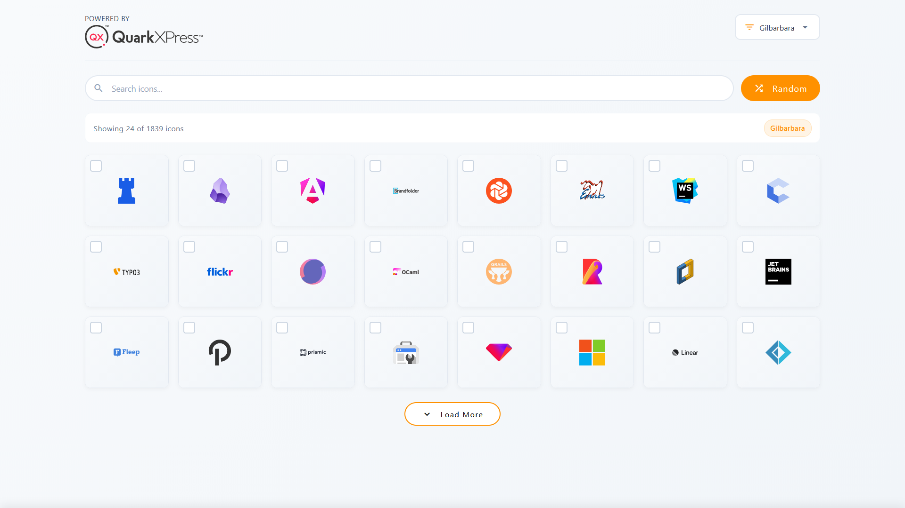
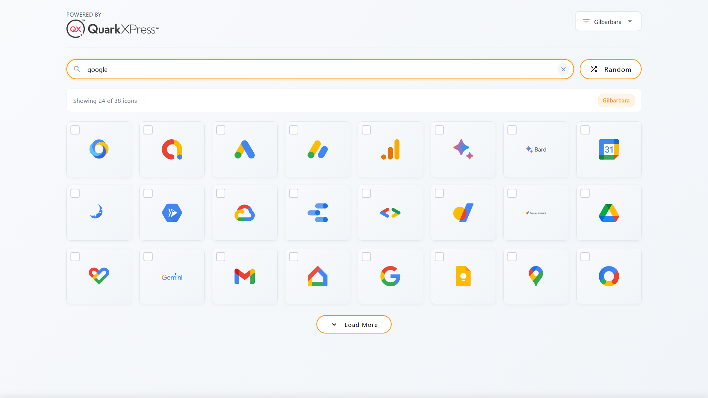

# Iconografix - Icon Library & Search Tool


A comprehensive, offline-first icon library application built with Angular that allows users to browse, search, and use icons from 8 popular icon libraries. Supports both standalone web usage and embedded plugin mode.

## ✨ Features

### 🎯 Core Functionality
- **8 Icon Libraries**: Bootstrap, Feather, Gilbarbara, Heroicons, Iconoir, Simple Icons, Brand Logos, and Tabler
- **Offline-First**: All icons are stored locally in assets - no external API dependencies
- **Smart Search**: Real-time search across all providers with intelligent matching
- **Multi/Single Selection**: Toggle between single icon selection and multi-select mode
- **Direct Integration**: Send selected icons directly to parent applications as base64 SVG

### 🎨 User Experience
- **Responsive Design**: Mobile-first approach with adaptive grid layouts
- **Modern UI**: Clean, intuitive interface with smooth animations
- **Visual Feedback**: Hover effects, selection indicators, and loading states
- **Tooltips**: Icon name tooltips with optimal positioning
- **Accessibility**: Keyboard navigation and screen reader support

### 🔧 Technical Features
- **Module Federation**: Plugin-ready architecture for embedded usage
- **Caching**: SVG content caching for improved performance
- **Smart Pagination**: Infinite scroll with load-more functionality
- **Error Handling**: Graceful fallbacks for missing icons
- **Standalone Components**: Modern Angular standalone component architecture
- **Type Safety**: Full TypeScript implementation with interfaces

## 📁 Project Structure

```
src/
├── app/
│   ├── components/
│   │   ├── icon-card/              # Individual icon display component
│   │   ├── loading-spinner/        # Loading animation component
│   │   ├── mode-selector/          # Single/Multi selection toggle
│   │   ├── provider-selector/      # Icon library dropdown selector
│   │   └── selection-footer/       # Bottom selection panel
│   ├── core/
│   │   ├── interceptors/           # HTTP interceptors for error handling
│   │   ├── models/                 # TypeScript interfaces and models
│   │   ├── services/
│   │   │   ├── providers/          # Icon provider services
│   │   │   ├── config.service.ts   # Configuration management
│   │   │   ├── download.service.ts # Icon download functionality
│   │   │   ├── environment.service.ts
│   │   │   └── selection.service.ts # State management for selections
│   │   └── types/                  # Type definitions
│   ├── pages/
│   │   └── home/                   # Main application page
│   ├── ql-plugin/                  # Plugin module for embedded usage
│   │   ├── ql-default-plugin/      # Default plugin component
│   │   ├── ql-plugin.module.ts     # Plugin module definition
│   │   └── ql-plugin-routing.module.ts
│   ├── app.component.ts            # Root application component
│   ├── app.module.ts               # Main application module
│   └── app-routing.module.ts       # Application routing
├── assets/
│   └── icons/                      # Local icon libraries storage
│       ├── bootstrap/
│       ├── feather/
│       ├── gilbarbara/
│       ├── heroicons-24-solid/
│       ├── iconoir/
│       ├── simple-icons/
│       ├── simple-svg-brand-logos/
│       └── tabler/
│           └── manifest.json       # Each library has its own manifest
├── environments/                   # Environment configurations
├── index.html                      # Main HTML entry point
└── styles.css                      # Global styles
```

## 🖼️ Screenshots

| Random Results | Search Results |
|-------------|----------------|
|  |  |

## 🚀 Installation & Setup

### Prerequisites
- Node.js 22+ and npm
- Angular CLI 16

### Installation Steps

1. **Clone and install dependencies:**
```bash
git clone https://github.com/SharadJ19/ICONS-Plugin-Local-Assets
cd ICONS-Plugin-Local-Assets
npm install
```

2. **Ensure icon assets are properly placed:**
```bash
# Icon libraries should be placed in:
src/assets/icons/
# Each library should have:
# - Individual SVG files
# - manifest.json listing all available icons
```

3. **Development server:**
```bash
ng serve
# Navigate to http://localhost:4219
```

4. **Production build:**
```bash
ng build --configuration production
```

## 🎮 Usage Guide

### Basic Usage
1. **Browse Icons**: Click "Random" to load icons from the selected provider
2. **Search**: Type in the search box to find specific icons
3. **Select Provider**: Use the dropdown to switch between 8 icon libraries
4. **Select Icons**: Click on icons to select them (supports both single and multi-select)
5. **Add to Project**: Use the selection footer to send icons to parent applications

### Selection Modes
- **Single Select**: Clicking an icon replaces previous selection
- **Multi Select**: Clicking toggles icons on/off, allowing multiple selections

### Integration as Plugin
The application can be embedded as a plugin using Module Federation:

```typescript
// In host application
import('iconografix/QlPluginModule')
  .then(m => {
    // Use the plugin module
  });
```

Selected icons are sent to the parent window via `postMessage` with base64-encoded SVG data.

## 🏗️ Architecture

### Provider System
The application uses a modular provider system where each icon library is implemented as a `LocalAssetProviderService`:

```typescript
interface LocalAssetProviderService {
  name: string;           // Unique identifier
  displayName: string;    // User-friendly name
  baseUrl: string;        // Path to icon assets
  initialize(): Observable<boolean>;  // Load manifest and icons
  search(query, limit, offset): Observable<IconApiResponse>;
  getRandom(limit, offset): Observable<IconApiResponse>;
  getSvgContent(icon): Observable<string>;
}
```

### State Management
- **Selection Service**: Manages icon selection state and mode (single/multi)
- **Provider Registry**: Central registry for all icon providers
- **Reactive Forms**: Search functionality with debounced input
- **Observable Streams**: RxJS for asynchronous operations and state updates

### Performance Optimizations
- **Lazy Loading**: Icons are loaded on-demand as needed
- **SVG Caching**: Once loaded, SVG content is cached locally
- **Virtual Scrolling**: Grid supports infinite scroll with pagination
- **Asset Preloading**: Provider manifests are loaded at startup

## 🔧 Configuration

### Environment Variables
Edit `src/environments/environment.ts` and `environment.prod.ts`:

```typescript
export const environment = {
  production: false,
  defaultProvider: 'ICONOIR',
  defaultLimit: 30,
  enableDebugLogging: true,
  assetsPath: '/assets/icons',
  svgCacheTimeout: 3600000,
  doubleClickThreshold: 300,
  searchDebounceTime: 400
};
```

### Adding New Icon Libraries

1. Add SVG files to `src/assets/icons/new-library/`
2. Run 'node .\scripts\generate-manifests.js' to generate it's manifest file.
3. Add provider configuration in environment files
4. Register provider in `ProviderRegistryService`

## 📱 Responsive Design

The application is fully responsive with breakpoints:
- **Mobile (< 480px)**: 2-3 columns
- **Tablet (768px)**: 4-5 columns
- **Desktop (1024px+)**: 6-10 columns

## 🔌 Plugin Integration API

When running in plugin mode, selected icons are sent to the parent window:

```javascript
window.parent.postMessage({
  type: 'ADD_OBJECT',
  payload: {
    dataString: 'data:image/svg+xml;base64,...',
    type: 'stickerbox',
    metaData: {
      name: 'Icon Name',
      provider: 'ICONOIR',
      fileName: 'icon_name_iconoir.svg'
    }
  }
}, '*');
```

## 🚨 Error Handling

The application includes comprehensive error handling:
- **Network errors**: Graceful fallback to local assets
- **Missing icons**: Fallback SVG displayed
- **Invalid searches**: Clear empty states with helpful messages
- **Provider failures**: Individual provider failures don't break the app

## 📄 Manifest Format

Each icon library requires a `manifest.json`:

```json
{
  "files": [
    "icon1.svg",
    "icon2.svg",
    "..."
  ]
}
```

## 🧪 Development

### Running Tests
```bash
ng test
```

### Building for Production
```bash
ng build --configuration production
```

### Code Structure Guidelines
- Components are feature-based and self-contained
- Services are singleton and provided in root
- Models are TypeScript interfaces for type safety
- Styles follow BEM-like naming conventions
- Mobile-first responsive design approach

## 🤝 Contributing

1. Fork the repository
2. Create a feature branch
3. Make your changes
4. Add tests if applicable
5. Submit a pull request

<!-- ## 📄 License -->

<!-- This project is licensed under the MIT License - see the LICENSE file for details.  -->

## 🙏 Acknowledgments

- Ashu Ma'am for the Guidance and Support throughout the project development
- All icon library authors and maintainers
- Angular and Material Design teams
- Contributors and testers

**Built with ❤️ using Angular and Material Design**
